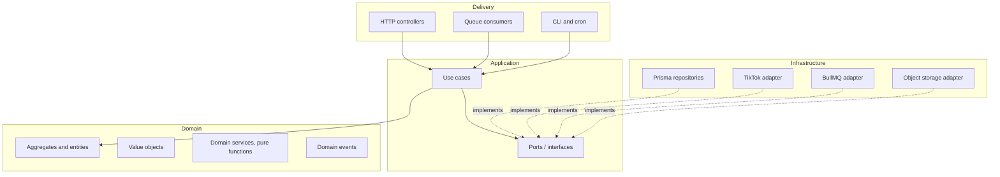
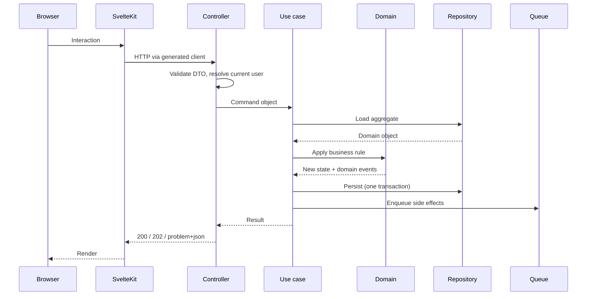
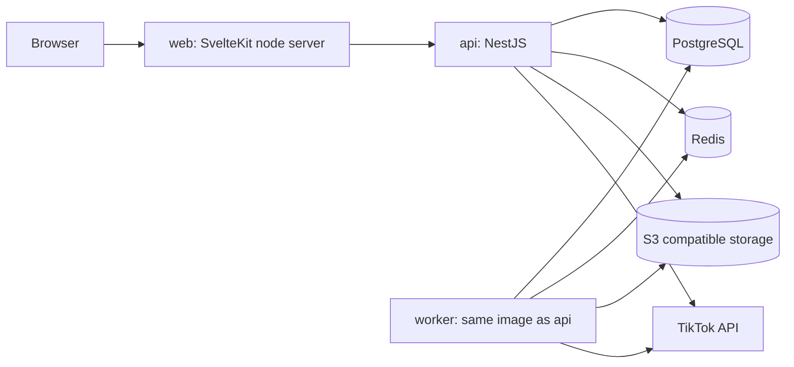

# Architecture

## Guiding shape

Onion architecture. Four layers, dependencies point inwards only. The domain knows nothing about HTTP,
Postgres, Redis or TikTok.



### Layer responsibilities

| Layer | Contains | May import from | Must never |
| --- | --- | --- | --- |
| **Domain** | Aggregates, entities, value objects, domain events, pure domain services | Nothing outside itself | Import a framework, touch IO, know a database exists |
| **Application** | Use cases, port interfaces, orchestration, transaction boundaries | Domain | Import a concrete adapter, or contain business rules that belong in the domain |
| **Infrastructure** | Prisma repositories, TikTok client, queue, storage, mail, cache | Domain, Application | Contain business rules, be imported by domain or application |
| **Delivery** | Controllers, DTOs, queue consumers, cron entry points, the SvelteKit app | Application, and Domain types only for mapping | Contain business rules, talk to a repository directly |

The rule is enforced by lint, not by good intentions. See task `0.2.2` in [TODO.md](TODO.md).

## Modules

Modularity means bounded modules with explicit contracts, not a folder called `utils`.

| Module | Owns | Exposes | Depends on |
| --- | --- | --- | --- |
| `identity` | Users, sessions, password credentials | `CurrentUser`, `requireUser` | Nothing |
| `accounts` | Connected TikTok accounts, tokens, connection health | `AccountPort`, `TokenProvider` | `identity` |
| `library` | Videos, assets, metrics history, sync | `VideoQuery`, `VideoRepository` | `accounts` |
| `taxonomy` | Categories, subcategories, tags, assignments | `TaxonomyQuery` | `identity` |
| `batch` | Batch jobs, work items, execution, retries | `BatchJobService` | `library`, `accounts` |
| `automation` | Flows, nodes, runs, triggers, scheduler | `FlowService` | `batch`, `library` |
| `audit` | Append only audit trail | `AuditWriter` | `identity` |

Cross module rules:

1. A module talks to another module **through its published contract only**. No reaching into
   `../other-module/internal/...`.
2. A module never imports another module's Prisma models. It goes through the owning module's query service.
3. When two modules need to react to each other, prefer a **domain event** over a direct call.
4. If module A needs data from B on nearly every call, that is a signal the boundary is wrong. Revisit it in
   the Phase 6 architecture review rather than papering over it.

## The integration port, and why it matters

The most important boundary in this codebase:

```ts
// application/ports/tiktok-video.port.ts
export interface TikTokVideoPort {
  listVideos(account: AccountId, cursor?: Cursor): Promise<Page<RemoteVideo>>;
  getVideo(account: AccountId, id: RemoteVideoId): Promise<RemoteVideo | null>;
  publish(account: AccountId, request: PublishRequest): Promise<PublishReceipt>;
  // Capability flags, because the platform does not support everything.
  capabilities(): TikTokCapabilities;
}
```

Two implementations:

| Implementation | Used in | Behaviour |
| --- | --- | --- |
| `SeededTikTokAdapter` | Phase 1, all tests, demo mode | Reads and writes local seeded data. Simulates latency, pagination, rate limits and failures |
| `LiveTikTokAdapter` | Phase 3 onwards | Calls the real API through the rate limited client |

Chosen by configuration (`TIKTOK_ADAPTER=seeded|live`). This is what makes the Phase 1 to Phase 3 transition a
configuration change plus one new class, instead of a rewrite of the UI.

`capabilities()` exists because the available actions depend on the configured execution strategy, per
[ADR-0010](adr/0010-browser-session-execution.md). The UI asks the API what is
possible and renders accordingly, so an unsupported action is never offered and then silently fails.

## Domain modelling, applied lightly

DDD tactics we use:

- **Aggregates** with an explicit root and enforced invariants. `Video`, `BatchJob`, `Flow`, `User`.
- **Value objects** for anything with rules: `VideoId`, `Caption`, `Privacy`, `Slug`, `Cursor`, `Duration`.
  Constructed through a factory that validates, so an invalid instance cannot exist.
- **Domain events** for cross module reactions: `VideoSynced`, `BatchJobCompleted`, `MetricThresholdCrossed`.
- **Repositories** per aggregate, returning domain objects, never Prisma rows.

DDD ceremony we skip, and why:

- No separate bounded context per module with its own database. Overkill for a single deployable.
- No CQRS with separate read and write models. Reads are simple. Revisit only if the dashboard query forces it.
- No event sourcing. The audit log covers the "what happened" need without the complexity.

## Functional patterns

- Domain logic is **pure functions over immutable data**. Sorting, filtering, condition evaluation and graph
  validation are all pure and therefore trivially testable.
- Use cases return a **`Result<T, DomainError>`** rather than throwing for expected failures. Exceptions are
  reserved for genuine bugs and infrastructure faults.
- Side effects (IO, clock, randomness, id generation) are **injected**, never called inline. This is what makes
  the fake clock tests in the gates possible.
- Data transformation is expressed as composition of small functions rather than long imperative methods.

## Request lifecycle



Long running work never happens inside a request. A batch action returns `202 Accepted` with a job id, and the
worker does the work. See [features/batch-actions.md](features/batch-actions.md).

## Frontend architecture

The SvelteKit app mirrors the same discipline at a smaller scale.

```
apps/web/src/
├── lib/
│   ├── api/          # Generated client + thin wrappers. The ONLY place fetch happens.
│   ├── domain/       # Pure client side logic: selection maths, formatting, graph validation
│   ├── components/   # shadcn-svelte primitives and composed components. No data fetching.
│   ├── features/     # Feature slices: dashboard, taxonomy, jobs, automation
│   └── stores/       # Svelte stores for cross cutting client state
└── routes/           # Route level load functions, layouts, guards
```

Rules:

1. **No component fetches directly.** Data comes from a route `load` or a feature level service.
2. **No fixture data outside tests.** Enforced by the Phase 1 gate.
3. **URL is the source of truth** for filter, sort, page and selection scope. Views must be shareable.
4. **Server state and client state are separate.** Do not mirror API data into a store and then let it drift.
5. Components in `components/` are presentational and reusable. Anything that knows about videos lives in
   `features/`.

## Configuration and environments

- All configuration comes from the environment, validated once at boot with a schema. A missing or malformed
  variable stops the process with a readable error, it never produces a mysterious runtime failure later.
- No environment specific code branches beyond adapter selection. `if (production)` scattered through business
  logic is a smell.
- Local, CI and production run the same images with different configuration.

## Deployment topology



`api` and `worker` are the **same image with a different entry point**, so a use case behaves identically
whether it is triggered by a request or by a job.

## Architectural decisions

Each significant choice lives in [adr/](adr/). If you disagree with something here, the correct move is a new
ADR that supersedes the old one, not an undocumented change in the code.
