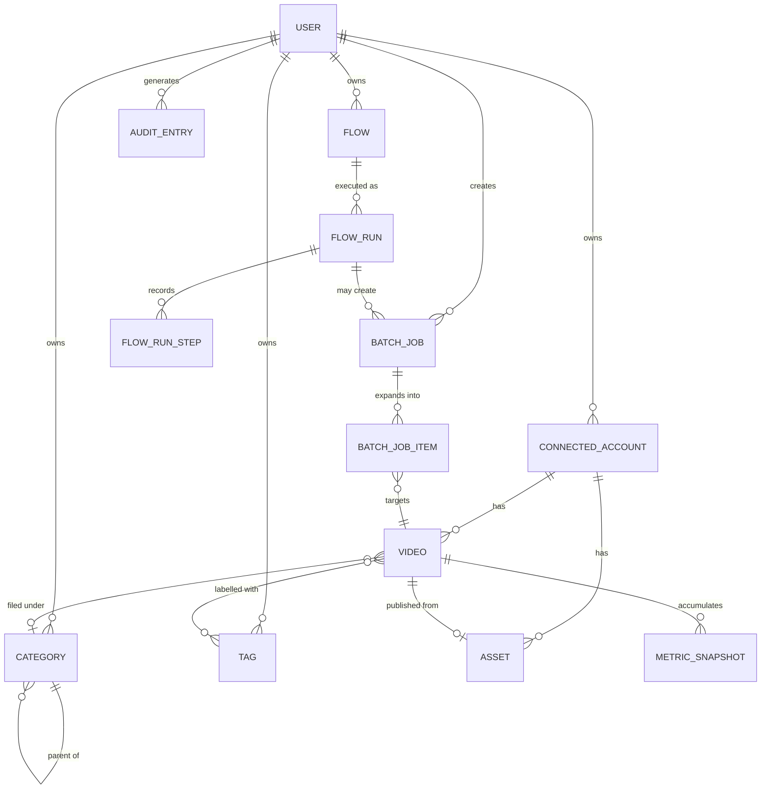

# Data model

The domain model first, then how it lands in PostgreSQL. Terminology matches [glossary.md](glossary.md).

## Aggregates

An aggregate is a consistency boundary. Everything inside one is saved in a single transaction. References
across aggregates are by id only, never by object reference.

| Aggregate | Root | Contains | Invariants |
| --- | --- | --- | --- |
| `User` | `User` | Credentials, sessions, settings | Email unique and normalised. A verified user has a verified timestamp |
| `ConnectedAccount` | `ConnectedAccount` | Tokens, scopes, sync state | Tokens encrypted. One remote account per user, once |
| `Video` | `Video` | Metric snapshots, local metadata, tag links | Belongs to exactly one account. A synced video always has a remote id |
| `Asset` | `Asset` | Upload parts, validation result | Not publishable until validation passes |
| `Category` | `Category` | Child categories | No cycles. Maximum depth 3. Slug unique per user |
| `BatchJob` | `BatchJob` | Work items | Terminal state is final. Item count never changes after creation |
| `Flow` | `Flow` | Nodes, edges, version | Exactly one trigger node. No unreachable node. No cycle |
| `FlowRun` | `FlowRun` | Step records | Belongs to one flow version. Steps are append only |

## Entity relationship

## Core tables

Fields below are indicative. The Prisma schema in `apps/api/prisma/schema.prisma` is authoritative once
task `1.1.3` lands.

### `users`

| Column | Type | Notes |
| --- | --- | --- |
| `id` | `ulid` | Primary key |
| `email` | `citext` | Unique, normalised lowercase |
| `password_hash` | `text` | Argon2id. Never leaves the infrastructure layer |
| `email_verified_at` | `timestamptz` | Null until verified |
| `created_at` / `updated_at` | `timestamptz` | |

### `connected_accounts`

| Column | Type | Notes |
| --- | --- | --- |
| `id` | `ulid` | |
| `user_id` | `ulid` | FK, cascade delete |
| `provider` | `text` | `TIKTOK` today. Present so a second platform is not a migration nightmare |
| `remote_user_id` | `text` | Unique with `provider` |
| `display_name`, `avatar_url` | `text` | Cached for display |
| `access_token_encrypted` | `bytea` | Envelope encrypted, see [security.md](security.md) |
| `refresh_token_encrypted` | `bytea` | |
| `token_expires_at` | `timestamptz` | |
| `scopes` | `text[]` | What was actually granted, which may be less than requested |
| `connection_status` | `enum` | `HEALTHY`, `NEEDS_RECONNECT`, `REVOKED` |
| `last_synced_at` | `timestamptz` | |

Unique index on `(provider, remote_user_id)`.

### `videos`

Split conceptually into remote mirrored fields and local only fields. Local fields must survive any resync.

| Column | Type | Source | Notes |
| --- | --- | --- | --- |
| `id` | `ulid` | local | |
| `account_id` | `ulid` | local | FK |
| `remote_id` | `text` | remote | Null for a not yet published draft |
| `title` | `text` | remote | |
| `caption` | `text` | remote | |
| `cover_url` | `text` | remote | May expire, refreshed on sync |
| `share_url` | `text` | remote | |
| `duration_seconds` | `int` | remote | |
| `privacy` | `enum` | remote | `PUBLIC`, `FRIENDS`, `PRIVATE`, `UNKNOWN` |
| `status` | `enum` | local | `DRAFT`, `SCHEDULED`, `PUBLISHING`, `PUBLISHED`, `FAILED`, `REMOVED_REMOTELY` |
| `published_at` | `timestamptz` | remote | |
| `view_count`, `like_count`, `comment_count`, `share_count` | `bigint` | remote | Latest snapshot, denormalised for sorting |
| `metrics_updated_at` | `timestamptz` | local | Drives the staleness warning |
| `category_id` | `ulid` | local | Nullable FK |
| `notes` | `text` | local | Free text, never sent upstream |
| `deleted_remotely_at` | `timestamptz` | local | Set when a sync no longer sees it. We do not hard delete |
| `created_at` / `updated_at` | `timestamptz` | local | |

Indexes: `(account_id, published_at desc)`, `(account_id, view_count desc)`, `(account_id, status)`,
`(account_id, category_id)`, unique `(account_id, remote_id)`, plus a trigram or full text index for `q`.

Every sort key needs an index that includes `id` as a tiebreaker, otherwise cursor pagination is not stable.

### `metric_snapshots`

| Column | Type | Notes |
| --- | --- | --- |
| `video_id` | `ulid` | FK |
| `captured_at` | `timestamptz` | Part of the primary key |
| `view_count`, `like_count`, `comment_count`, `share_count` | `bigint` | |

Append only. Enables trend conditions such as "gained fewer than 100 views in 7 days". Retention policy is
defined in task `3.1.4`. Consider a partition or a rollup once it grows.

### `categories` and `tags`

| `categories` | Type | Notes |
| --- | --- | --- |
| `id` | `ulid` | |
| `user_id` | `ulid` | FK |
| `parent_id` | `ulid` | Nullable, self FK, maximum depth 3 |
| `name` | `text` | |
| `slug` | `text` | Unique per `(user_id, parent_id)` |
| `colour` | `text` | Optional UI hint |
| `position` | `int` | Manual ordering |

| `tags` | Type | Notes |
| --- | --- | --- |
| `id` | `ulid` | |
| `user_id` | `ulid` | FK |
| `name` | `text` | Unique per user, case insensitive |
| `colour` | `text` | |

`video_tags` is the join table with `(video_id, tag_id)` as the primary key, which makes assignment naturally
idempotent.

### `assets`

| Column | Type | Notes |
| --- | --- | --- |
| `id` | `ulid` | |
| `account_id` | `ulid` | FK |
| `storage_key` | `text` | Object storage key |
| `original_filename` | `text` | |
| `size_bytes` | `bigint` | |
| `checksum_sha256` | `text` | Verified after upload completes |
| `mime_type`, `codec`, `width`, `height`, `duration_seconds`, `fps` | mixed | From probing |
| `validation_status` | `enum` | `PENDING`, `VALID`, `REJECTED` |
| `validation_errors` | `jsonb` | Structured, so the UI can render actionable messages |
| `upload_status` | `enum` | `IN_PROGRESS`, `COMPLETE`, `ABANDONED` |

Abandoned assets are garbage collected on a schedule. Storage is not free.

### `batch_jobs` and `batch_job_items`

| `batch_jobs` | Type | Notes |
| --- | --- | --- |
| `id` | `ulid` | |
| `user_id` | `ulid` | FK |
| `action` | `enum` | `UPLOAD`, `PUBLISH`, `SET_PRIVACY`, `DELETE`, `ADD_TAG`, `REMOVE_TAG`, `SET_CATEGORY`, `EDIT_METADATA` |
| `selection` | `jsonb` | Either explicit ids or a saved filter, recorded verbatim for audit |
| `parameters` | `jsonb` | Action specific, schema validated per action |
| `status` | `enum` | `QUEUED`, `RUNNING`, `SUCCEEDED`, `PARTIALLY_FAILED`, `FAILED`, `CANCELLED` |
| `total_count`, `succeeded_count`, `failed_count` | `int` | |
| `idempotency_key` | `text` | Unique per user |
| `dry_run` | `bool` | |
| `created_by_flow_run_id` | `ulid` | Nullable. Links automation to its effects |
| `started_at`, `finished_at` | `timestamptz` | |

| `batch_job_items` | Type | Notes |
| --- | --- | --- |
| `id` | `ulid` | |
| `batch_job_id` | `ulid` | FK |
| `video_id` / `asset_id` | `ulid` | Whichever the action targets |
| `status` | `enum` | `PENDING`, `RUNNING`, `SUCCEEDED`, `FAILED`, `SKIPPED` |
| `attempt_count` | `int` | |
| `error_code`, `error_detail` | `text` | Stable code for logic, detail for humans |

Partial failure is a normal outcome. Retry re-runs only the failed items and appends attempts, it never resets
history.

### `flows`, `flow_runs`, `flow_run_steps`

| `flows` | Type | Notes |
| --- | --- | --- |
| `id` | `ulid` | |
| `user_id` | `ulid` | FK |
| `name`, `description` | `text` | |
| `graph` | `jsonb` | Nodes and edges, schema versioned |
| `graph_schema_version` | `int` | Migrated forward on read |
| `version` | `int` | Incremented on save, used for `If-Match` |
| `is_enabled` | `bool` | |
| `last_run_at`, `next_run_at` | `timestamptz` | |

| `flow_runs` | Type | Notes |
| --- | --- | --- |
| `id` | `ulid` | |
| `flow_id` | `ulid` | FK |
| `flow_graph_snapshot` | `jsonb` | The exact graph that ran. Editing a flow must not rewrite history |
| `trigger_type`, `trigger_payload` | mixed | |
| `status` | `enum` | `RUNNING`, `SUCCEEDED`, `FAILED`, `CANCELLED`, `TIMED_OUT` |
| `is_dry_run` | `bool` | |
| `idempotency_key` | `text` | Unique per trigger occurrence, prevents double firing |

| `flow_run_steps` | Type | Notes |
| --- | --- | --- |
| `id` | `ulid` | |
| `flow_run_id` | `ulid` | FK |
| `node_id` | `text` | Id within the graph |
| `sequence` | `int` | Execution order |
| `input`, `output` | `jsonb` | Truncated above a size limit |
| `status`, `error_code` | mixed | |
| `started_at`, `finished_at` | `timestamptz` | |

Storing the graph snapshot per run is what makes a run trace trustworthy months later.

### `audit_entries`

| Column | Type | Notes |
| --- | --- | --- |
| `id` | `ulid` | |
| `user_id` | `ulid` | Actor |
| `actor_type` | `enum` | `USER`, `SYSTEM`, `FLOW` |
| `action` | `text` | For example `video.privacy_changed` |
| `target_type`, `target_id` | `text` | |
| `parameters` | `jsonb` | Secrets redacted before write |
| `outcome` | `enum` | `SUCCESS`, `FAILURE` |
| `trace_id` | `text` | Ties back to logs |
| `created_at` | `timestamptz` | |

Append only. No update path exists in the code, and the database role has no `UPDATE` grant on this table.

## Conventions

- **ULIDs** for every primary key. Sortable by creation time, safe to expose, no sequence contention.
- **`timestamptz` everywhere**, always stored in UTC. Timezone is a presentation concern, except for cron
  triggers where the user's timezone is stored explicitly alongside the expression.
- **Soft delete for user data.** `deleted_at` rather than a `DELETE`, so an accidental bulk action is
  recoverable. Hard deletion only for a genuine account deletion request.
- **Every table carrying user data has a `user_id` or a path to one**, and the repository layer always scopes
  by it. Isolation is not a controller concern.
- **`jsonb` only for genuinely open shapes** (graphs, parameters, error details). Anything queried or sorted
  gets a real column.
- **Migrations are forward only** in normal operation. Every migration is reviewed for lock behaviour on a
  large table before it merges.

## Local versus remote, the rule that matters most

TikTok owns: caption, cover, metrics, privacy, publish time.
We own: tags, category, notes, status history, job history, automation state.

A sync **updates remote owned fields and never touches local owned fields**. This is asserted by an
integration test in the Phase 3 gate, because getting it wrong silently destroys the user's organisational
work, which is the entire value of the product.
