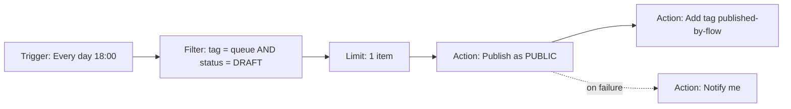

# Feature: automation engine

A visual, node based workspace for building TikTok publishing and lifecycle automations. The feel of n8n, the
scope of one platform, and a deliberate refusal to become a programming language.

Builder in Phase 1 group `1.5`, runtime in Phase 5, both in [../TODO.md](../TODO.md).

## Design stance

| Principle | What it means in practice |
| --- | --- |
| **Understandable at a glance** | A flow reads left to right: trigger, then filters, then actions |
| **No code in version 1** | No expression language, no scripting node, no regular expressions in the UI |
| **Schema driven configuration** | Every node declares its config schema and the form is generated from it |
| **Explainable** | The user can always see what a flow did, and what it will do next |
| **Safe by default** | Dry run, limits, kill switch, confirmation before a flow may act destructively |

Deliberately excluded from version 1: loops, sub flows, custom code nodes, HTTP request nodes, arbitrary
branching depth beyond one level. Every one of them turns a no-code tool into a debugging tool.

## Anatomy of a flow



- Exactly **one trigger** per flow.
- Nodes pass an **execution context** along the edges: a list of items plus accumulated variables.
- Every node is pure with respect to its inputs, so a run is reproducible from its trace.

## Node catalogue, version 1

### Triggers

| Node | Configuration | Fires when |
| --- | --- | --- |
| **Schedule** | Cron expression with the user's timezone, or a friendly picker | The schedule is due |
| **Manual** | None | The user clicks run |
| **New video synced** | Optional filter | A sync discovers a new video |
| **Metric threshold crossed** | Metric, comparison, value, filter | A video crosses the threshold, once per video per threshold |
| **Video age reached** | Age in days, filter | A video reaches the age, once per video |

Every trigger occurrence carries an **idempotency key**, so two workers cannot fire the same occurrence twice.

### Filters and logic

| Node | Purpose |
| --- | --- |
| **Filter** | Keep items matching a condition. The same condition vocabulary as the dashboard filters |
| **If / else** | Split into two branches on a condition. One level of nesting, no more |
| **Limit** | Keep the first N items after an explicit sort. Essential for a drip feed queue |
| **Sort** | Order items by a field, so `Limit` is deterministic |
| **Wait** | Delay for a duration, or until a specific time of day |

Condition vocabulary: age, views, likes, comments, shares, duration, privacy, status, category, tag, caption
contains, growth over a period (from `metric_snapshots`).

**Stale metrics rule:** any condition using a metric declares a maximum acceptable staleness. If the data is
older than that, the flow either triggers a sync first or skips the item, and it records which it did. Acting
on unknowingly stale data is how an automation deletes a video that actually did well.

### Actions

| Node | Effect | Notes |
| --- | --- | --- |
| **Publish** | Publish an asset or a scheduled draft | Uses the Phase 4 pipeline |
| **Set privacy** | Change privacy | Subject to platform capability, otherwise a tracked manual action |
| **Delete** | Delete a video | Same, and always requires flow level confirmation |
| **Add / remove tag** | Local taxonomy | Always available |
| **Set category** | Local taxonomy | Always available |
| **Notify** | Email now, more channels later | Includes a link to the run trace |

Every action node delegates to the **batch job machinery** from
[batch-actions.md](batch-actions.md). There is exactly one implementation of "publish a video" in this
codebase, and automation reuses it rather than reimplementing it.

## Execution semantics

1. A trigger fires and creates a `FlowRun` with an idempotency key and a **snapshot of the graph**.
2. Nodes execute in topological order, one at a time. No parallel branches in version 1.
3. Each step records its input, output, duration and status in `flow_run_steps`.
4. Guardrails, all configurable with sane defaults:
   - maximum steps per run
   - maximum items per run
   - maximum runs per hour per flow
   - run timeout
   - cycle detection at save time and again at run time
5. A node failure ends the run as `FAILED`, unless an `on failure` edge exists, in which case that branch runs.
6. A run interrupted by a worker restart resumes from the last completed step. This is why every step is
   persisted rather than held in memory.
7. **Dry run** executes the whole graph with every action node stubbed, and produces a full trace showing what
   would have happened. Zero side effects, asserted against the audit log.

## Builder experience

| Capability | Detail |
| --- | --- |
| Palette | Categorised node list with search, drag onto the canvas or double click to append |
| Canvas | Pan, zoom, minimap, snap to grid, auto layout button, multi select, copy and paste |
| Connections | Drag from an output port to an input port. Invalid connections are refused with a reason |
| Configuration | Side panel, schema generated form, inline validation, plain language help per field |
| Validation | Continuous. Problems appear on the node and in a problems list. A flow cannot be enabled while invalid |
| Undo and redo | Full history for the session |
| Autosave | Debounced, with an explicit saved indicator and optimistic concurrency through `If-Match` |
| Templates | Starter flows for the common scenarios, editable after insertion |
| Testing | Run once with a dry run, inspect the trace, then enable |

Validation rules, each with a unit test in both the valid and invalid case: exactly one trigger, no orphan
nodes, no cycles, every required field set, every referenced tag or category still exists, no destructive
action without confirmation, at most one level of branching.

## Run observability

- Run list per flow: when, trigger, status, items processed, duration.
- Run detail: the graph with each node coloured by outcome, and a step by step table with inputs and outputs.
- A link from any affected video back to the run that touched it, and from the run to the batch job it created.
- Replay a run with the same input, for debugging.
- Alerting on repeated failures, so a broken flow does not fail silently for a month.

## Graph format

Stored as versioned JSON. `graph_schema_version` is migrated forward on read, never rewritten in place on the
stored row until the flow is saved.

```json
{
  "schema_version": 1,
  "nodes": [
    { "id": "n1", "type": "trigger.schedule", "position": { "x": 0, "y": 0 },
      "config": { "cron": "0 18 * * *", "timezone": "Europe/Stockholm" } },
    { "id": "n2", "type": "filter.condition", "position": { "x": 240, "y": 0 },
      "config": { "all": [ { "field": "tag", "op": "includes", "value": "queue" },
                           { "field": "status", "op": "eq", "value": "DRAFT" } ] } },
    { "id": "n3", "type": "action.publish", "position": { "x": 480, "y": 0 },
      "config": { "privacy": "PUBLIC" } }
  ],
  "edges": [
    { "id": "e1", "source": "n1", "target": "n2" },
    { "id": "e2", "source": "n2", "target": "n3", "source_handle": "matched" }
  ]
}
```

The format is deliberately boring and portable: JSON, ids, positions, config. Export and import is then almost
free, which is why it is in the backlog rather than being a rewrite later.

## Starter templates

1. **Drip feed queue.** Daily at a set time, take the oldest draft tagged `queue`, publish it as public, tag it
   `published`.
2. **Underperformer cleanup.** Weekly, find videos older than 30 days with fewer than 1,000 views, make them
   private, tag them `archived`, and notify me with the list.
3. **Hit promoter.** When a video crosses 100,000 views, add it to the `Best of` category and notify me.

Each template ships with a description of exactly what it will do, and starts disabled.

## Failure modes to design for

| Failure | Handling |
| --- | --- |
| TikTok rate limits mid run | The action pauses and retries with backoff. The run stays `RUNNING`, it does not fail |
| Token expired or revoked | The run fails fast with `NEEDS_RECONNECT` and notifies. It does not retry forever |
| A referenced tag was deleted | Validation catches it at save time. At run time the step is skipped and recorded |
| The user edits the flow mid run | The run uses its snapshot. Editing never changes a run already in flight |
| Two workers pick up the same trigger | The idempotency key means one run exists. Verified by an integration test |
| A flow would act on 5,000 videos | The item cap stops it and notifies, rather than quietly doing it |
