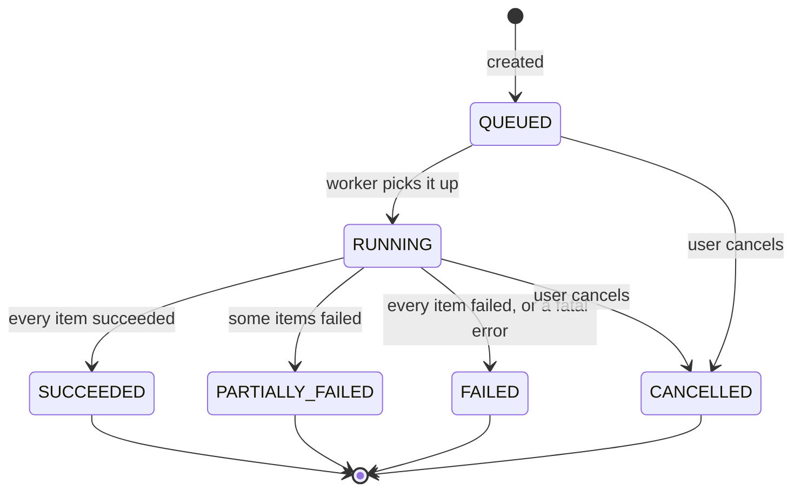

# Feature: batch actions

One user intent applied to many videos, executed asynchronously, observable while it runs and auditable
afterwards. Built in Phase 1 group `1.4` of [../TODO.md](../TODO.md), made real in Phase 4.

## The model



A job is created with a **selection**, expanded once into **items**, and each item is processed independently.
The item count never changes after creation, which is what makes progress reporting truthful.

Terminal states are final. A retry creates a **new job** that references the original, rather than reopening
history.

## Supported actions

| Action | Target | `BROWSER` strategy | `API` strategy |
| --- | --- | --- | --- |
| `ADD_TAG` / `REMOVE_TAG` | Videos | Local only, always available | Local only, always available |
| `SET_CATEGORY` | Videos | Local only | Local only |
| `EDIT_NOTES` | Videos | Local only | Local only |
| `UPLOAD` | Assets | Supported | **Supported, and better** |
| `PUBLISH` | Assets | Supported | **Supported, and better.** Privacy set at post time |
| `SET_PRIVACY` | Videos | **Supported** | No API support, manual fallback |
| `DELETE` | Videos | **Supported** | No API support, manual fallback |
| `EDIT_METADATA` | Videos | **Supported** | No API support, manual fallback |

The API exposes a **capability matrix** per connected account, computed from the configured execution strategy
per [ADR-0010](../adr/0010-browser-session-execution.md). The UI never offers an action that cannot be
performed. See [../tiktok-integration.md](../tiktok-integration.md).

### Extra states for the browser strategy

Browser driven actions can fail in ways an API cannot, so the job model gains two non terminal states:

| State | Meaning | Resolution |
| --- | --- | --- |
| `AWAITING_ATTENTION` | A captcha, login challenge or unrecognised page interrupted the run | The user opens the live browser view, resolves it, and the job resumes from the last completed item |
| `SELECTORS_STALE` | The canary check failed, TikTok's interface has changed | The job stops before clicking anything. Fail visibly rather than click blind |

Neither is a failure. Both are pauses, and both preserve per item progress.

### The manual fallback

Now a **degradation path**, not the primary mechanism. It applies when the browser strategy is unavailable,
selectors are stale, or the user has chosen the `API` strategy.

- The job is created with status `AWAITING_MANUAL`, with one item per video.
- The UI shows a checklist with a deep link to each video inside TikTok, in the user's chosen order.
- The user completes it there and marks each item done, or bulk marks the batch as done.
- The next sync verifies reality rather than trusting the tick box.

The UI copy explains exactly why the step is manual, and links to the reasoning.

## Selections

A selection is either explicit or filter based.

```json
{ "type": "IDS", "video_ids": ["01HQ...", "01HR..."] }
```

```json
{
  "type": "FILTER",
  "filter": { "status": ["PUBLISHED"], "view_count": { "lt": 1000 },
              "published_at": { "lte": "2025-01-01T00:00:00Z" } }
}
```

Filter selections are resolved to ids **once, at job creation**, and the resolved list is stored. Otherwise the
job's meaning drifts while it runs, which is precisely the class of bug that deletes the wrong videos.

The original filter is stored alongside the resolved ids for audit purposes.

## Safety mechanisms

Batch operations are the most dangerous thing this application does.

1. **Dry run.** `dry_run: true` returns the full impact preview with zero side effects. Asserted by checking
   the audit log, not by trusting the implementation.
2. **Impact preview before confirmation.** "This will make 47 videos private, including 3 with over 100,000
   views." Specific, quantified, and it names the notable items.
3. **Typed confirmation** for destructive actions. Type the count or the word `DELETE`.
4. **Idempotency keys** are mandatory. The same key returns the original job. A different body with the same
   key is `409`.
5. **Batch size cap** per job from configuration. Larger selections are split into explicit jobs the user
   approves individually.
6. **Rate limit aware pacing** so a large batch does not burn the account's quota or trip abuse detection.
7. **Cancellable while queued or running.** Items already processed are not rolled back, and the report says so
   plainly.
8. **Kill switch** halts every job and flow run at once.
9. **Full audit** for every item: actor, action, target, parameters, outcome, trace id.

## Execution

- One queue per action type, so a slow upload queue cannot starve the instant tagging queue.
- Concurrency and rate limits per queue, from configuration.
- Retry with exponential backoff and jitter, with a maximum attempt count. Only **retryable** errors are
  retried: `429`, `5xx`, timeouts and network faults. A validation failure is never retried.
- Progress is emitted per item, so the UI shows real progress rather than a spinner.
- Workers are resumable. A worker killed mid job leaves items in a recoverable state and another worker
  finishes the job. This is verified by killing the container in the Phase 1 gate.
- Local only actions (tagging, categorising) run in a single transaction where possible and complete almost
  instantly. Do not queue what can be done inline in 50 ms, but do report it through the same job model so the
  UI is consistent.

## Results and reporting

Every job produces a report:

| Field | Purpose |
| --- | --- |
| Counts | Total, succeeded, failed, skipped |
| Per item outcome | Video, status, error code, human readable reason |
| Duration | Started, finished, elapsed |
| Origin | Manual, or the flow run that created it |
| Actions | Retry failed items only, export the report as CSV |

Error codes are stable strings the UI can branch on and the docs can explain. Free text is for humans only.

## Job centre UI

- A live list of running jobs with per job progress bars.
- History, filterable by action, status and date.
- A job detail view with the item table, filterable by outcome.
- "Retry failed" creates a new job containing only the failed items.
- A notification when a long running job finishes while the user is elsewhere in the app.

## API summary

Full definitions live in the OpenAPI spec. Conventions in [../api-guidelines.md](../api-guidelines.md).

| Endpoint | Purpose |
| --- | --- |
| `POST /v1/batch-jobs` | Create. Requires `Idempotency-Key`. Returns `202` plus `Location`, or `200` for a dry run |
| `GET /v1/batch-jobs` | List, filterable, cursor paginated |
| `GET /v1/batch-jobs/{id}` | Detail with counts and status |
| `GET /v1/batch-jobs/{id}/items` | Per item results, paginated |
| `POST /v1/batch-jobs/{id}/cancel` | Cancel if not terminal |
| `POST /v1/batch-jobs/{id}/retry` | New job from the failed items |
| `GET /v1/accounts/{id}/capabilities` | What this account can actually do |

## Testing focus

Beyond the gate items in [../TODO.md](../TODO.md), these deserve explicit tests because they are where the
damage happens:

- A filter selection resolved at creation does not change if the underlying data changes mid run.
- A job with 100 items where 3 fail ends `PARTIALLY_FAILED` and retry re-runs exactly those 3.
- The same idempotency key posted twice yields exactly one job.
- A dry run writes nothing anywhere, verified against the audit log.
- A worker killed at item 50 of 100 results in a completed job with no duplicated work.
- Cancelling mid run stops further items and reports accurately on what already happened.
